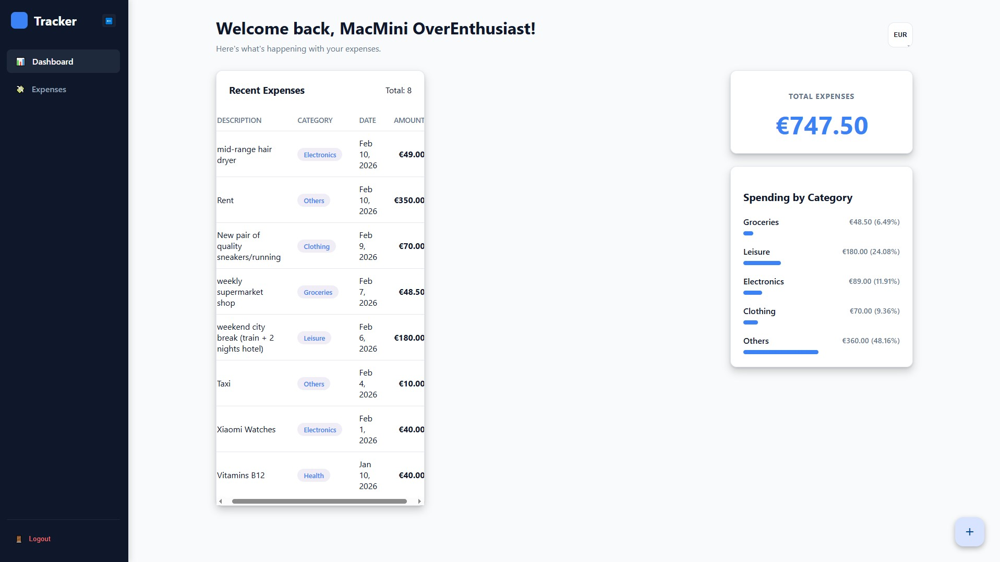
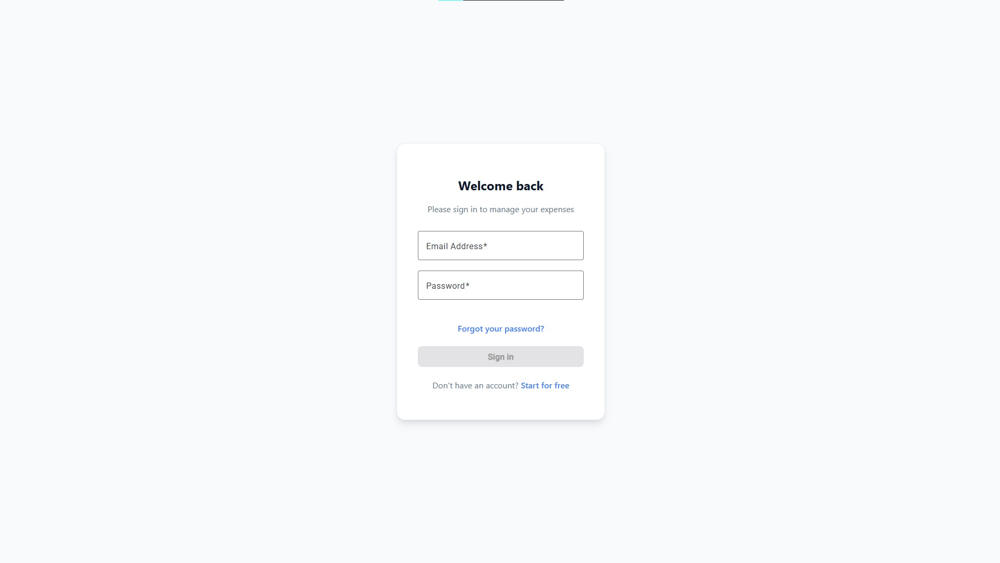
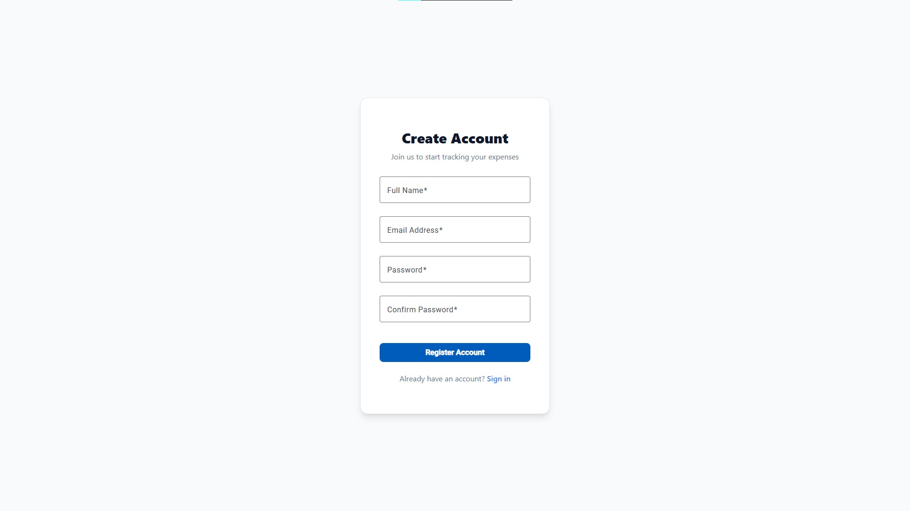

# 💸 ExpenseTracker App

A full-stack, containerized expense management application built with **.NET 9**, **Angular**, and **PostgreSQL**. This project features a professional DevOps architecture using Nginx as a reverse proxy and automated Docker orchestration.

---

## 🖼️ Preview






---

## 🛠️ Tech Stack

### Backend
* **Framework:** .NET 9 (Web API)
* **Architecture:** Clean Architecture (Domain, Application, Infrastructure, API)
* **Identity:** ASP.NET Core Identity with JWT Authentication
* **Database:** PostgreSQL with EF Core Migrations

### Frontend
* **Framework:** Angular 18+
* **State Management:** Angular Signals & Signal Store
* **Styling:** CSS3 (Minimalist UI)
* **Proxy:** Nginx (Serving as a Reverse Proxy & SPA host)

### DevOps & Infrastructure
* **Containerization:** Docker & Docker Compose
* **Networking:** Nginx Reverse Proxy (Routes `/api` to Backend)
* **Persistence:** Docker Volumes for PostgreSQL data

---

## 🚀 Quick Start (Run in 2 Commands)

Ensure you have [Docker Desktop](https://www.docker.com/products/docker-desktop/) installed and running.

### Clone the repository
```bash
git clone [https://github.com/SoV3n04ek/ExpenseTracker.git](https://github.com/SoV3n04ek/ExpenseTracker.git)
cd ExpenseTracker
docker compose up -d --build
```

That's it!

Frontend: http://localhost

Backend API (Swagger): http://localhost:8080/swagger

## Key Features
Secure Auth: JWT-based authentication with email confirmation and password reset.

Modern UI: Minimalist, mobile-responsive dashboard with currency customization.

Soft Delete: Records are flagged as deleted rather than removed, ensuring data integrity.

Automated Infrastructure: Database migrations and network bridges are handled automatically via Docker.

## 🛡️ Development & Logs
To view real-time logs for the backend:

```Bash
docker compose logs -f expense-backend
```

## 🏛️ About the Project: Architecture & Design
This application is built following the principles of Clean Architecture (Onion Architecture), ensuring a strict separation of concerns that makes the system highly testable and independent of external frameworks.

The solution is divided into four distinct layers:

Domain: The core of the system, containing enterprise logic, entities, and value objects. It has zero dependencies on other layers or libraries like EF Core.

Application: Orchestrates the flow of data. It contains the business logic, service interfaces (DTOs), and mapping profiles.

Infrastructure: Handles all "external" concerns. This is where the PostgreSQL database is implemented via Entity Framework Core, along with the concrete implementation of the Email Service.

Presentation (API): A thin layer responsible for handling HTTP requests, JWT authentication, and providing the OpenAPI (Swagger) documentation.

By decoupling the business logic from the infrastructure, the project is designed to be "future-proof"—allowing the database or frontend framework to be swapped out with minimal impact on the core logic. The use of Docker and Nginx further extends this philosophy to the infrastructure level, providing a consistent, production-ready environment for every developer.

---
### 📖 Documentation
For a deep dive into the technical architecture, request lifecycle, and mental models of this project, check out the [Technical Walkthrough](./walkthrough.md).