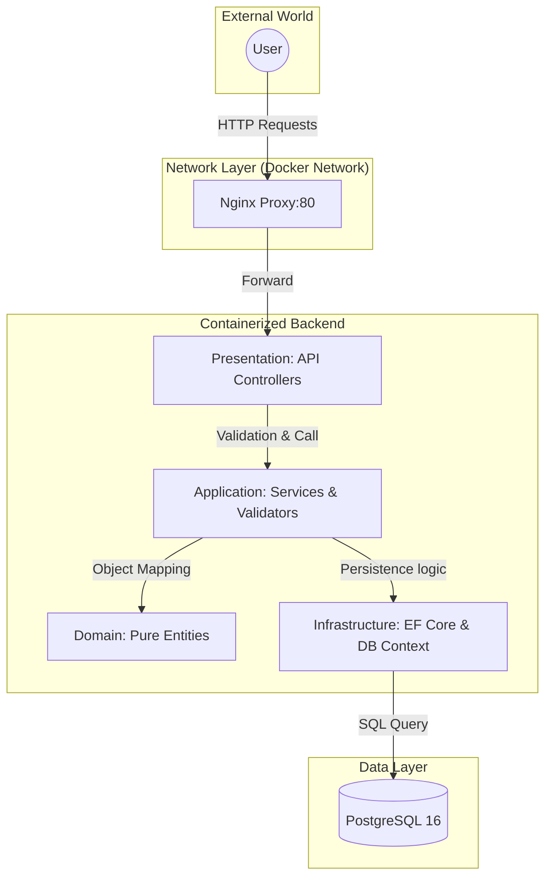
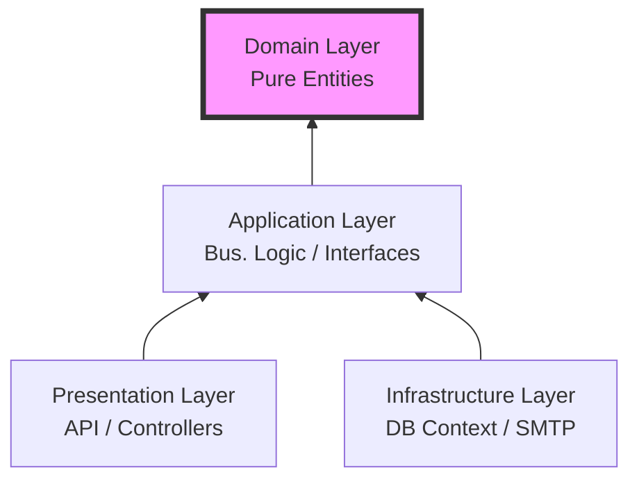

# 🏛️ Architectural Deep-Dive & Blueprint

This document details the internal mechanics of the **ExpenseTracker** ecosystem, from infrastructure orchestration to the core business logic.

---

## 1. Request Lifecycle: `POST /api/expenses`
When a user interacts with the application, the request travels through several layers of abstraction.

* **Entry Point (Angular UI):** The user submits a form. The `ExpenseStore` (using Angular Signals) dispatches a request to `/api/expenses`.
* **Gateway (Nginx Proxy):** The request hits Nginx on port `80`. Nginx identifies the `/api` path, strips the prefix (as defined in `nginx.conf`), and routes the traffic to the `expense-backend` container on port `8080`.
* **Presentation Layer:** The `ExpensesController` receives the DTO (Data Transfer Object).
* **Security & Validation:** `FluentValidation` checks data integrity. If validation fails, the `CustomExceptionHandler` middleware intercepts the error and returns a clean, RFC-compliant error response.
* **Business Logic (Application):** The `ExpenseService` maps the DTO to a **Domain Entity**.
* **Persistence (Infrastructure):** EF Core receives the entity, translates the change into a SQL `INSERT` statement, and commits it to the **PostgreSQL** instance.

---

## 2. Visual Mental Models

### A. The Full Ecosystem Flow
This diagram illustrates the containerized journey of data across the Docker network.

### B. Clean Architecture (The Dependency Rule)
Dependencies always point inward. The Domain is the stable center; it does not know about the Database, the UI, or Docker.

### C. Layer Breakdown

| Layer | Responsibility | Key Components |
| :--- | :--- | :--- |
| **Domain** | Core Business Logic | Entities, Value Objects, Logic Exceptions |
| **Application** | Orchestration | Services, DTOs, Validators, Interfaces |
| **Infrastructure** | External Concerns | EF Core, Migrations, Email (SMTP), Logging |
| **Presentation** | Entry Points | Controllers, Middleware, Auth (JWT) |